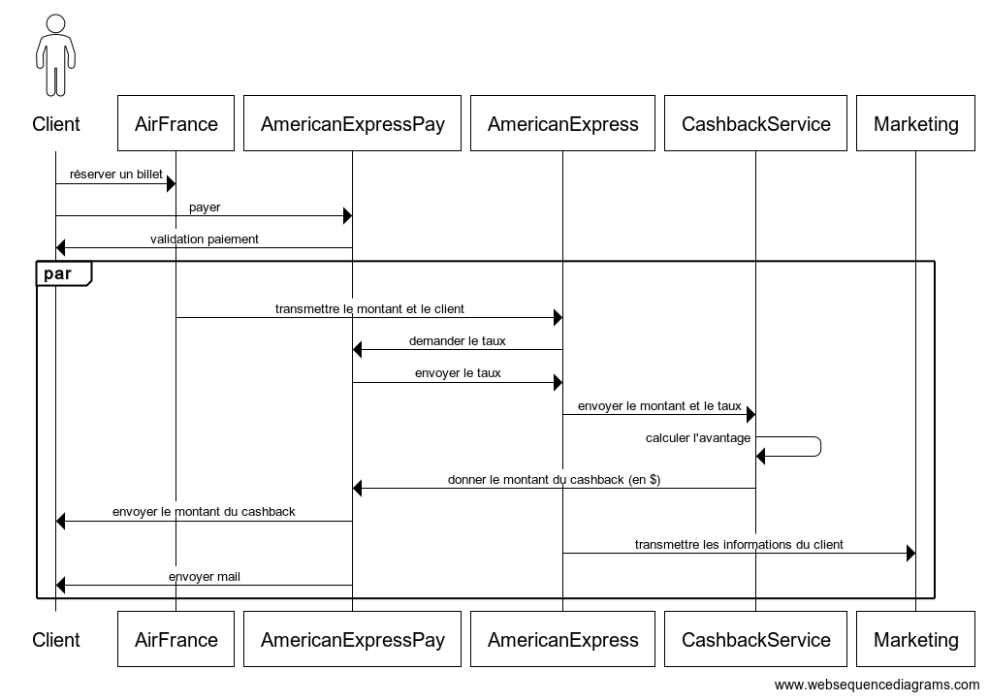
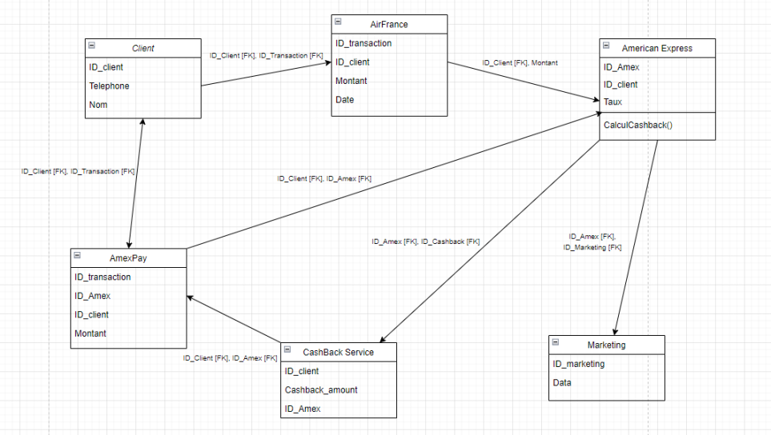

## Objectifs du système à modéliser
Le projet vise à mettre en place un système de cashback pour une carte platinum AmericanExpress, impliquant plusieurs acteurs majeurs.

Les acteurs comprennent un client utilisant la carte, Air France en tant que service marchand, American Express avec sa base de données, le service de paiement AmexPay, utilisé par le client, un service marketing et un service dédié au cashback.

Le flux d'activités commence par le client effectuant un paiement chez Air France avec AmexPay. Les données de cette transaction sont enregistrées par Air France, puis transmises à American Express. American Express analyse les données et, si le client correspond aux critères définis par le service marketing, envoie les informations à ce dernier.

Simultanément, les données de la transaction sont également acheminées vers le service de cashback avec le montant du cashback. Ce montant est ensuite envoyé à AmexPay. Le client, connecté à AmexPay, a ainsi accès à l'argent provenant du cashback.

Les communications entre les différents services sont spécifiées comme suit : le client communique avec Air France et AmexPay, Air France communique avec American Express, American Express communique avec le service marketing et le service de cashback, et enfin, le service de cashback communique avec AmexPay.


## Interfaces

```
actor Client
AirFrance
AmericanExpressPay
AmericanExpress
CashbackService
Marketing


Client -> AirFrance : réserver un billet
Client -> AmericanExpressPay : payer 
AmericanExpressPay -> Client : validation paiement 

par 
AirFrance -> AmericanExpress : transmettre le montant et le client
AmericanExpress -> AmericanExpressPay : demander le taux 
AmericanExpressPay -> AmericanExpress : envoyer le taux
AmericanExpress -> CashbackService : envoyer le montant et le taux 
CashbackService -> CashbackService   : calculer l'avantage
CashbackService -> AmericanExpressPay : donner le montant du cashback (en $)
AmericanExpressPay -> Client : envoyer le montant du cashback
AmericanExpress -> Marketing : transmettre les informations du client
AmericanExpressPay -> Client : envoyer mail
end 
```


## Schéma relationnel
susceptible d’évoluer en fonction des besoins


## Exigences fonctionnelles
1. **Enregistrement des Transactions :**
    - Le système DOIT enregistrer toutes les transactions effectuées par les clients utilisant la carte platinum chez Air France via AmexPay.
  
2. **Transmission des données à American Express :**
    - Air France DOIT transmettre les données de chaque transaction à American Express.

3. **Analyse des Données par American Express :**
    - American Express DOIT analyser les données des transactions reçues.

4. **Communication avec le Service Marketing :**
    - American Express DOIT communiquer avec le service marketing pour partager les données des clients éligibles au cashback et répondant aux critères définis par le service marketing.
    - Les données transmises DOIVENT inclure les détails du client et toute information pertinente pour les promotions.

5. **Calcul du Cashback :**
    - Le service de cashback DOIT recevoir les données de la transaction et calculer le montant du cashback en fonction des règles prédéfinies.
    - Le montant du cashback calculé DOIT être transmis à AmexPay pour être mis à la disposition du client.

## Exigences non fonctionnelles

* Les opérations H2M (Human To Machine) DOIVENT utiliser Rest et messaging.
* Les opérations M2M (Machine To Machine) DOIVENT utiliser JMS